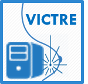

.. breastMass documentation master file, created by
   sphinx-quickstart on Wed Sep 19 14:31:53 2018.
   You can adapt this file completely to your liking, but it should at least
   contain the root `toctree` directive.

breastMass Documentation
========================

Welcome to the VICTRE breastMass software documentation!

This documentation provides information regarding how to download, install, and use the VICTRE breastMass software which generates breast cancer masses with random sizes and shape properties.  These mass models can be inserted into  anthropomorphic voxelized whole-breast phantoms generated by the VICTRE software package breastPhantom to create virtual patients.

This software is an independent reimplementation of the model described in

Sisternes, L. , Brankov, J. G., Zysk, A. M., Schmidt, R. A., Nishikawa, R. M. and Wernick, M. N. (2015), *A computational model to generate simulated three‐dimensional breast masses*. Med. Phys., 42: 1098-1118. `doi:10.1118/1.4905232 <https://doi:10.1118/1.4905232>`_

	   
This software  was developed as part of the `Virtual Imaging
Clinical Trials for Regulatory Evaluation (VICTRE) project <https://github.com/DIDSR/VICTRE>`_ at the `U. S. Food and Drug Administration <https://www.fda.gov>`_.

The VICTRE tools provide a complete simulated imaging chain for mammography and digital breast tomosynthesis and are available as `open source software <https://github.com/DIDSR/VICTRE>`_

.. toctree::
   :maxdepth: 2
   :caption: Contents:

   operation
   installation
   running
   files
   config
      

